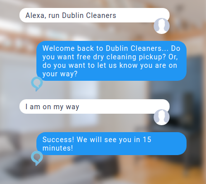

# Beta Testing

## Getting Started

We look for 3 takeaways with our beta tests:

1. Film of Beta Test
   1. 1 Unscripted Interaction
   2. 1 Scripted Interaction
2. Recorded Feedback after Interaction

## Film of Beta Test

Filming the beta test is out Football Footage. This data is essential to refining our customer experience. When filming the beta test be sure to Record 2 interactions with the Beta Tester:

1. Unscripted Interaction
2. Scripted Interaction

Be sure to follow the following guidelines when filming: 

* Film contains Speaker
* Film contains Voice Assistant Device
* Film contains entire conversation session \(start-to-end\)

### Unscripted Interaction

The Unscripted Interaction allows us to see how customers organically use our voice assistants. Tell your Beta Tester to start the conversation session with the following phrase:

> "Alexa, run Dublin Cleaners"

### Scripted Interaction

The Scripted Interaction allows us to film a customer using a standard interaction. **Pick the script your Beta Tester** _**did not**_ **follow during the unscripted interaction.** Tell your Beta Tester to start the conversation session following either script:

#### Script 1: On My Way

#### Script 2: Pickup Request

