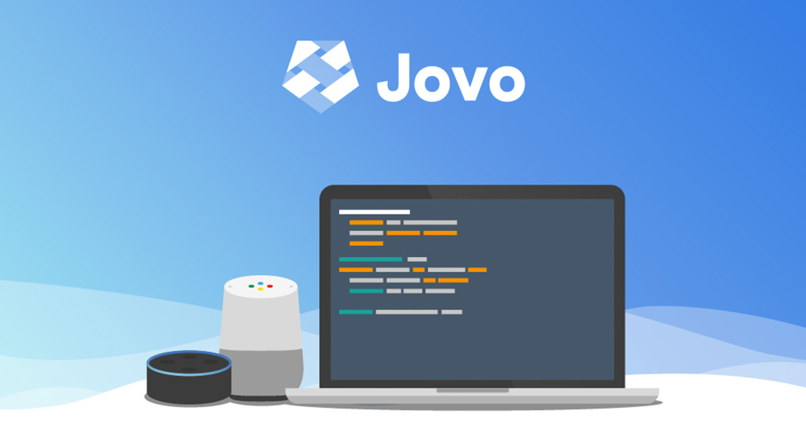
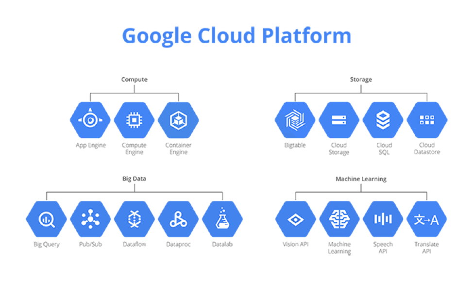
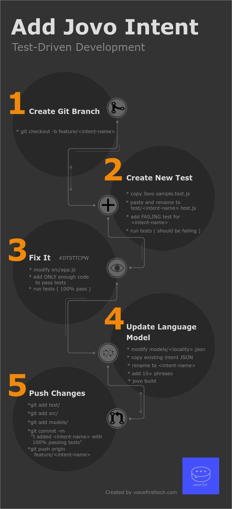

# Battle Dragons

## Get Started

In order to battle dragons, we have to first imagine the kingdom we are trying to protect. Our noble steed is headed towards the dry cleaning kingdom. **We are solving problems for the dry cleaning kingdom using voice technology powered by AI**. Our kingdom is old, stagnant, and ripe for innovation. Our universe has gone decades without significant innovation. Our kingdom has many problems needing solved. Dragons are popping up everywhere. Customers are being slain. The kingdoms are in ruin. **You are accountable to build magical improvements to the kingdom.**

1. Your Armory 
2. Training Grounds
3. Going into Battle


Weapons from the Armory are granted randomly so please submit an issue if you're not happy with yours.


## 1. Your Armory

We first discovered the armory hidden by our ancestors. Our researchers found the following formula at the gates to the armory:

 $$voicefirstai = NodeJS + Jovo + Python + AWS + Google Cloud + Firebase + Gitlab + CLI$$ 

### NodeJS 

**Our helmet and armor.** The programming language we use. It runs serverless in the AWS Cloud, locally with the `jovo run` command, and comes with a handy package installer called `npm`.

Download: [https://nodejs.org/en/](https://nodejs.org/en/)

Learn More: [https://en.wikipedia.org/wiki/Node.js](https://en.wikipedia.org/wiki/Node.js)

### Jovo

**Our broadsword**. This is an extension of our armor \(nodeJS\). Jovo is a NodeJS Framework for Voice App Development. This is our main weapon for slaying dragons. We have close ties with the artisans who craft these swords \([King Jan](https://twitter.com/einkoenig)\). You should spend time in the training grounds practicing Jovo before you head into battle.

Download: [https://www.jovo.tech/\#getting-started](https://www.jovo.tech/#getting-started)

Learn More: [https://youtu.be/DsVVek8exAs](https://youtu.be/DsVVek8exAs)

### Python

**Our dagger**. Python is what we use for backend automation and deployments. Python is what sends our apps to the Amazon Kingdom for their approval. Python is our special weapon when our broadsword \(Jovo\) just won't cut it.

Download: [https://www.python.org/downloads/](https://www.python.org/downloads/)

Learn More: [https://www.learnpython.org/](https://www.learnpython.org/)

### AWS

One of the **warrior guilds** we belong to. AWS gives us one of our greatest resources, the cloud. AWS keeps all of our magical apps safe, secure, and scalable to all of our kingdoms.

Login: [https://aws.amazon.com/](https://aws.amazon.com/)

Learn More: [https://aws.amazon.com/what-is-aws/](https://aws.amazon.com/what-is-aws/)

### Google Cloud

One of the **mage guilds** we use Google Cloud Platform \(GCP\) to store our tools and apps in the cloud. GCP runs functions on our customer data to draw insights for our AI. 

Login: [https://cloud.google.com/](https://cloud.google.com/)

Learn More: [https://cloud.google.com/why-google-cloud/](https://cloud.google.com/why-google-cloud/)

### CLI

The **metal** that forms our weapons and armor. It underlies all of our tools and is a fundamental tool for all knights-in-training to understand. 

Learn More: [https://learngitbranching.js.org/](https://learngitbranching.js.org/)

### Firebase

Our **noble assistant.** Firebase saves our data in the cloud. Owned by our mage guild, Google, Firebase is our Website, Database, Authentication, and Authorization. 

Login: [https://firebase.google.com/](https://firebase.google.com/)

Get Started: [https://youtu.be/k1D0\_wFlXgo](https://youtu.be/k1D0_wFlXgo)

### Gitlab

Our **backpack**. Gitlab stores all of our apps in one, protected, place. It also comes with tools that test our apps and send them to the kingdom of AWS for their approval.

Learn More: [https://youtu.be/MqL6BMOySIQ](https://youtu.be/MqL6BMOySIQ)

Get Started: [https://gitlab.com/](https://gitlab.com/)

## 2. Training Grounds

Once you're strong enough, head to the training grounds:

* Jovo Training Grounds
* Voice First AI Training Grounds
* Git Training Grounds
* Algorithm Training Grounds

### **Jovo Training Grounds**

Get Started for Free: [https://www.jovo.tech/courses](https://www.jovo.tech/courses)

### Voice First AI Training Grounds

Get Started for Free: [https://www.udemy.com/ultimate-voice-dev-course/learn/](https://www.udemy.com/ultimate-voice-dev-course/learn/)

### Git Training Grounds

Get Started for Free: [https://learngitbranching.js.org/](https://learngitbranching.js.org/)

### Algorithm Training Grounds

Get Started for Free: [https://leetcode.com/problemset/all/](https://leetcode.com/problemset/all/)

## 3. Going into Battle

Once you're strong enough, go into battle against the most fierce dragons. You'll need to follow our rules of battle:

* Picking your Quest \(Trello\)
* Creating your Checklist \(Test-Driven Development\)
* Magically Manage all Kingdoms \(Continuous Integration\)

### Test Driven Development

1. Write a failing test case
2. DTSTTCPW
3. Create Commit

edit [here](https://github.com/VoiceFirstTech/voicefirsttech.com/edit/master/how-to/sell-the-future.md)

