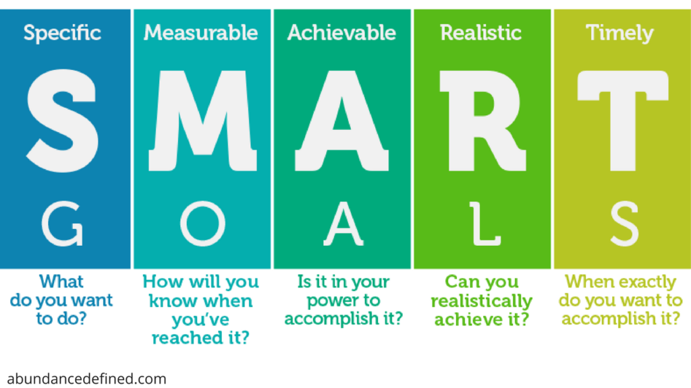
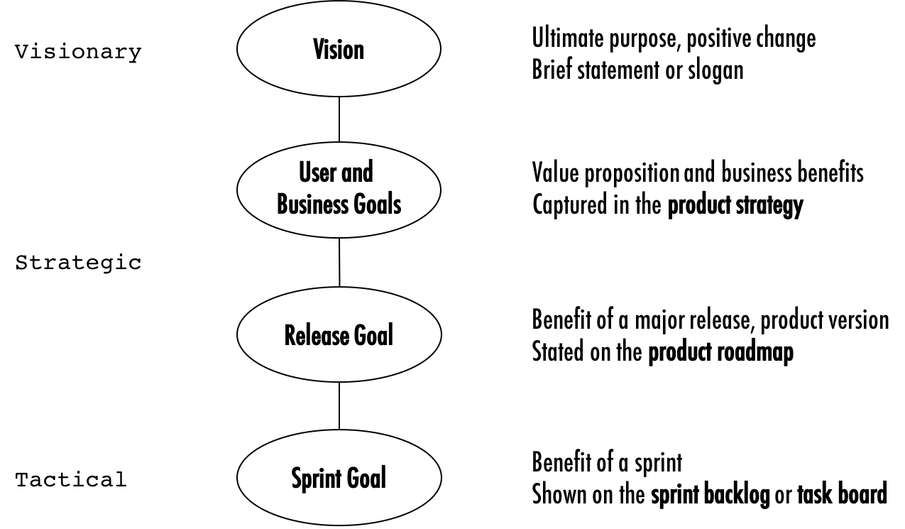

# Create your Own Adventure

## Get Started

Now that we have made friends & learned from their stories, we have to create an adventure to help them save the Princess and blow up the Death Star. Our noble steed is headed towards the dry cleaning kingdom. **We are solving problems for the dry cleaning kingdom using voice technology powered by AI**. This section is all about creating adventures for voice. If you are setting goals, this is where you should start. **You are accountable for creating adventures that solve friend's problems.** On your adventures to creating your own adventure, you will learn the following skills:

1. S.M.A.R.T. Goals
2. Sprint Goals
3. Standup Goals


Friends & Stories from the Socialites Guild are granted randomly so please submit an issue if you're not happy with yours.


## S.M.A.R.T. Goals

* **Specific** - What do you want to do?
* **Measurable** - How will you know when you've reached it?
* **Achievable** - Is it in your power to accomplish it?
* **Realistic** - Can you realistically achieve it?
* **Timely** - When exactly do you want to accomplish it?

Examples:

* "{Deadline\), I will {Action} {Measurement} {Things}"
* "Today, I will **make** 5 sales calls"
* "By Friday, I will **merge** the new [NotifyArrival](https://docs.voicedrycleaner.com/notifyarrival) feature into `master.` "
* "This Tuesday, I will speak at the [Voice Summit AI conference](https://www.voicesummit.ai/)."

## Sprint Goals

The [Sprint Goal](https://www.scrum.org/resources/blog/11-advantages-using-sprint-goal) is an objective set for the Sprint that can be met through the implementation of Product Backlog. Sprint goals are the result of a negotiation between the Product Owner and the Development Team. Sprint Goals should be specific and measurable. While the selected work for the Sprint Backlog represents a forecast, the Development Team gives their commitment to achieving the Sprint Goal.

### Why Using a Sprint Goal?

An effective Sprint Goal...

1. Serves to test assumptions, address risks or **deliver features**
2. Ensures a focused Daily Scrum because the Development Team can use it to inspect their progress
3. Provides guidance to the Development Team on why it is building the Increment
4. Offers flexibility regarding the functionality implemented within the Sprint
5. Helps **setting priorities** when "the going gets tough"
6. Fosters teamwork and teambuilding by jointly working towards a shared Sprint Goal
7. Supports the Product Owner in **creating the product roadmap**
8. Stimulates Product Backlog cohesion when planning a release
9. Can be used as an instrument for stakeholder management
10. Supports a focused Sprint Planning by crafting a shared Sprint Goal
11. Enables **efficient decision-making**

## Standup Goals

[Daily Standup ](https://www.scrum.org/resources/what-is-a-daily-scrum)is a 15-minute time-boxed event for the Team to synchronize activities and create a plan for the next 24 hours. The Daily Standup is held every day of the Sprint. At it, the Development Team plans work for the next 24 hours. This optimizes team collaboration and performance by inspecting the work since the last Daily Standup and forecasting upcoming Sprint work. The Daily Standup is held at the same time and place each day to reduce complexity.

Each member of the team quickly states:

1. What did you do _yesterday_ ? 
2. What are you working on _today_? 
3. What are the _barriers_ slowing you down?

