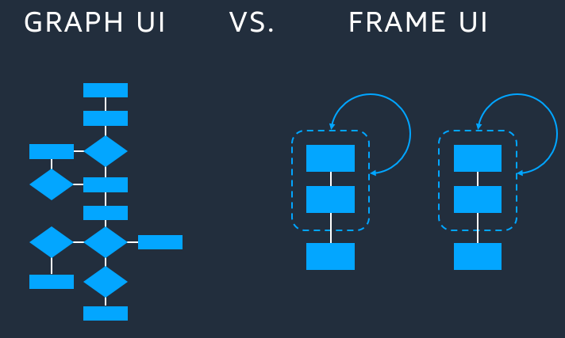
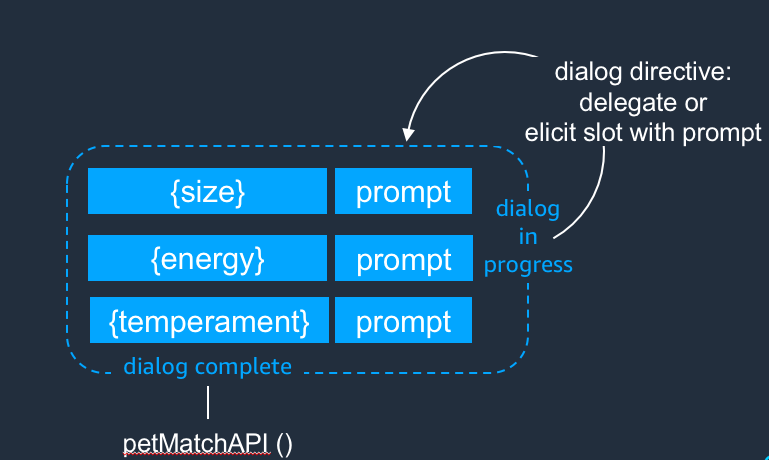

# Design Quests

## Get Started

In order to bring our adventures to life, we have to first design quests. Our noble steed is headed towards the dry cleaning kingdom. **We are solving problems for the dry cleaning kingdom using voice technology powered by AI**. This section is all about designing features for voice. If you are UX / UI / Voice Designer / etc this is where you should start. **You are accountable for designing a magical customer experience.** On your adventures to design quests, you will learn the following skills:

1. How to Pick a Galaxy 
2. How to Pick a Planet
3. How to Draw the Map


Adventures from the Interplanetary QuestMasters are granted randomly so please submit an issue if you're not happy with yours.


## 1. Pick a Galaxy

Once you're strong enough, _pick your galaxy_:

**Customer Obsession Statement is ...** 

 $$voicefirstai = NodeJS + Jovo + Python + AWS + Google Cloud + Firebase + Gitlab + CLI$$ 

### NodeJS 

**Our helmet and armor.** The programming language we use. It runs serverless in the AWS Cloud, locally with the `jovo run` command, and comes with a handy package installer called `npm`.

Download: [https://nodejs.org/en/](https://nodejs.org/en/)

Learn More: [https://en.wikipedia.org/wiki/Node.js](https://en.wikipedia.org/wiki/Node.js)

## 2. Pick a Planet

Once you're strong enough, _pick your planet_:

When **SpaceX** chose a planet to pick to expand humanity to, did they just pick a galaxy willy-nilly? No! They had defined **core functionality** of their planet. In order for humans to live on another planet, it needs to have:

* Temperatures sustainable for human infrastructure.
* Terrain possible for human traversal.
* Resources to sustain human life.

**Core Functionality is the top 3-5 things customers will have when the quest is complete.** These are like the rewards of quest completion. For example, the core functionality for NotifyArrival was

* Customers send "On My Way" notifications to their dry cleaner using Amazon Alexa.
* Business owners receive POS, SMS, and email notifications of customers on the way.
* Customers can only send 1 "On My Way" notification each day via POS.

## 3. Draw the Map

Once you're strong enough, _draw the map for adventurers to follow_:

**Frame Design creates a conversation around intents and required inputs.** Frame Design is the easiest and most scalable way to build voice apps. Before frame design was graph design. Here's a look at the difference:

Graph design was great for web and mobile design, where flows were linear. Users were limited to button presses, screen swipes, and input boxes. With voice, customers have much more freedom to interact with your designs in unexpected ways. Frame design improves upon Graph UI for the following reasons:

* Frame Design uses less code.
* Frame Design is more flexible to customer input.
* Frame Design is better at simulating natural conversation.

Now that we understand why Frame Design is better than Graph Design, let's take a closer look at Frame Design in action:

On the **left** you see the **slots** needing filled in order to complete the customer's intent.   
On the **right** you the see the **prompts** Alexa gives in order to fill the prompts. 

edit [here](https://github.com/VoiceFirstTech/internal-voicedrycleaner/edit/master/how-to/battle-dragons.md)

