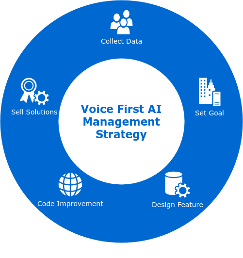

# Make Friends & Learn from Stories

## Get Started

Our vision is to communicate screenlessly. We provide magic spells, swords, and armor for our customers that give them to survive in the Age of AI. Our noble steed is headed towards the dry cleaning kingdom. **We are solving problems for the dry cleaning kingdom using voice technology powered by AI**. This section is all about collecting customer data for voice. If you are setting goals, this is where you should start. **You are accountable for making friends with people from the biggest and best kingdoms.** On your adventures to making friends and learning from stories, you will learn the following skills:

1. Communicate Screenlessly
2. Identify an Industry
3. Identify key players
4. Identify their pain points


Questions, Remixes, and Ideas from the Innovation Guild are granted randomly so please submit an issue if you're not happy with yours.


## Communicate Screenlessly

The 1960-2010s was the age of screens. The world was eaten by software as we embraced screens in entertainment, education, information, etc. We shoved a screen nearly everywhere we could fit one. [Kevin Kelly](https://kk.org/), founder of [Wired](https://www.wired.com/), describes the trend as [**Screening**](https://en.wikipedia.org/wiki/The_Inevitable_%28book%29)**.** 

Yin - Yang...

Benefits - Costs...

Screening brought with it many side effects...

> “Many people are looking at the benefits of digital media in education, and not many are looking at the costs,” said Patricia Greenfield, a distinguished professor of psychology in the UCLA College and senior author of the study. “**Decreased sensitivity to emotional cues** — losing the ability to understand the emotions of other people — is one of the costs. The displacement of in-person social interaction by screen interaction seems to be reducing social skills.” - [source](http://newsroom.ucla.edu/releases/in-our-digital-world-are-young-people-losing-the-ability-to-read-emotions), [study / data](https://www.sciencedirect.com/science/article/pii/S0747563214003227)

There is more information conveyed in _human-to-human_ interaction than via screens. 

> "When engaging in **face-to-face communication**, social information is conveyed by vocal and visual cues within the context of the situation." - [source](https://www.sciencedirect.com/science/article/pii/S0747563214003227)

We leverage voice technology to _10x human-face-to-face connectivity_.

> "A lot of school systems are rushing to put iPads into the hands of students individually, and I don't think they've thought about the \[social\] cost," she explains. "This study should be, and we want it to be, a wake-up call to schools. They have to **make sure their students are getting enough face-to-face social interaction.** That might mean reducing screen time." - [source](https://www.npr.org/sections/ed/2014/08/28/343735856/kids-and-screen-time-what-does-the-research-say)

## Identify an Industry

To explore a second industry that will have the biggest positive impact on Voice First AI. Following the criteria:

* Creates synergy with **existing businesses in Columbus Ohio**
* Has large market opportunity
* Voice is the key technology to innovate the industry
* The industry has a low barrier to experimentation and implementation

#### Columbus, Ohio

Columbus is prime for the exploration and expansion of voice technologies because:

* Low Cost of Living
* Proximity to Universities
* Location of Major Headquarters
* Funded for growth with SMART Columbus

## Identify Key Players

A key player is someone who...

* Someone that has customers who will use our app
* Someone who will pay us 
* Someone who loves voice

We find those key players by attending:

* Chamber of Commerce Meetings
* Local Alexa Meetups
* Voice in {X} Conferences
* Meet People IRL \(Communicate Screenlessly\)

## Identify their Pain Points

Once someone is identified as a key player.

1. Schedule A Meeting to talk more
2. Build a quick demo app \(Launch only\)
3. Go to Meeting

### Go to Meeting

* What went down at Dublin Cleaners today 
* Got to wave \(pre-meeting meeting\) 
* Standup \(meet w/ whole team about meeting\) 
* Tested and refined app \(quality control\) 
* Create ppt slide \(Visual\) 
* Messed up some test cases \(it’s ok\) 
* Coding and testing at same time 
* Fast iteration 
* Staying simple 
* Get to meeting 30min early 
* Chat with non management 
* Chat with customers 
* Observe things that we could not imagine \(this is why its good to be in physical reality often\) 
* Connect to wifi 
* Setup Alexa 
* Chit chat with the business owner and assistant 
* Banter, relate, create relationship \(laughing = a signal for I want to keep doing this\)

