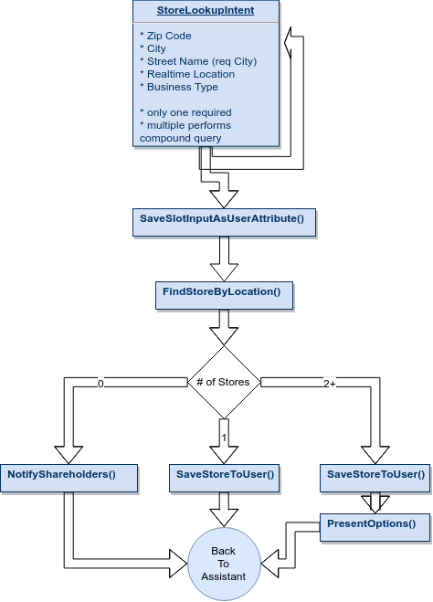

# Selina - Store Finder

## Getting Started

Currently, on Google you can't have meaningful interactions with search results. You **can** say: "_Find a tattoo parlor near me"_ and you will get the closest tattoo parlors to your location.You **can't** book an appointment, learn more about the store, etc. **With Selina, you can power your business voice assistant with Store Finder powers.** 

Let's explore what it does...

## Frame Design 

## Customer Obsession Statement

> "As a _young business professional_ I want to **lookup the closest store** to me using my voice" - Cam
>
> "As a _mother of 4_ I want to **save time** finding a voice dry cleaner near me." - Brenda
>
> "As a _young business professional_, I want **convenience** to dry clean while traveling for business trips and conferences" - Cam

## Core Functionality

* User can lookup store by **zip code, city, street name, and business type.**
  * Assistant finds closest store to location
* User can lookup store by **realtime location.**
  * Assistant finds closest store to user.
* If **multiple locations** present, pick first and give opportunity to hear more locations.
* Picked store is associated in **user data.**
* If no store is found, **notify shareholders** with as much data as possible to add store to voice in attribute location.

